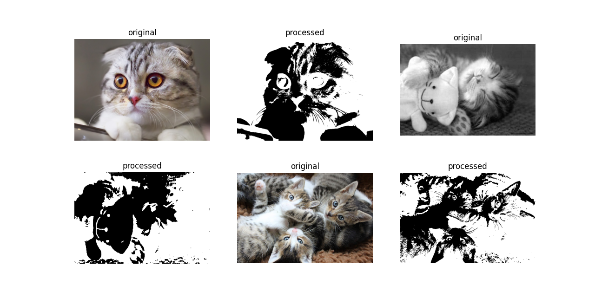
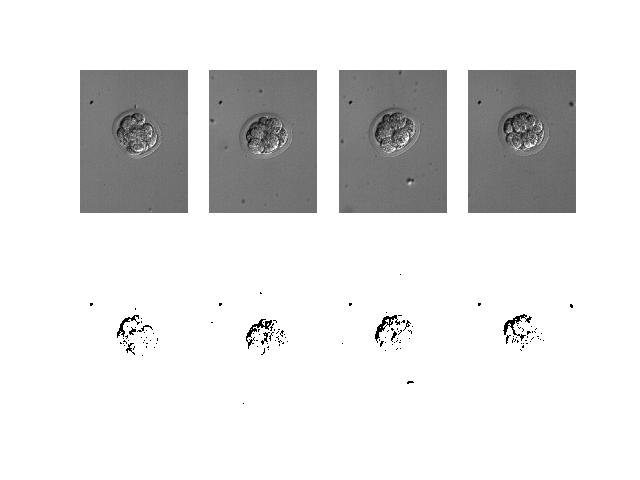
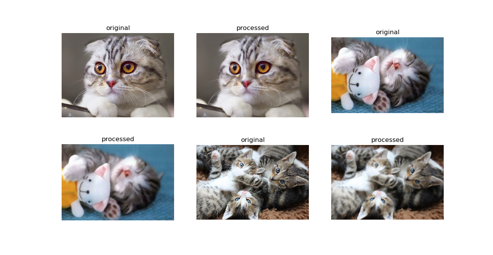

# (Semi) Automated Image Processing with pyautocv

 [](https://doi.org/10.5281/zenodo.3766956)


[](https://pypi.python.org/pypi/pyautocv/)
[](https://pypi.python.org/pypi/pyautocv/)
[](https://pypi.python.org/pypi/pyautocv/)
[](https://GitHub.com/Nelson-Gon/pyautocv/graphs/commit-activity)
[](https://github.com/Nelson-Gon/pyautocv/commits/master)
[](https://GitHub.com/Nelson-Gon/pyautocv/issues/)
[](https://GitHub.com/Nelson-Gon/pyautocv/issues?q=is%3Aissue+is%3Aclosed)
[](https://github.com/Nelson-Gon/pyautocv/blob/master/LICENSE)

**Project Aims**

The goal of `pyautocv` is to provide a simple computer vision(cv) workflow that enables one to automate 
or at least reduce the time spent in image (pre)-processing. 

**Installing the package**

From PyPI:

```

pip install pyautocv

```
From GitHub

```
pip install git+https://github.com/Nelson-Gon/pyautocv.git
#or
# clone the repo
git clone https://www.github.com/Nelson-Gon/pyautocv.git
cd pyautocv
python3 setup.py install

```

**Available Classes**

* Segmentation is a super class on which other classes build

* EdgeDetection is dedicated to edge detection. Currently supported kernels are stored in `.available_operators()`

* Thresholding dedicated to thresholding.


**Example Usage**

**Simple Script(Currently only supports thresholding)**


To run the script at the  command-line, we can do the following:

```

# Ensure you have your paths set well
# This assumes that we are inside the package's top level directory

 python scripts/processing.py -d "images/cats" -s "png" -m "binary_inverse" -o "threshold" -mt 250 -t 50


```

Sample Result




To get help:

```

python scripts/processing.py -h 


```


* Image Gra(e)ying

To grey an image directory:

```python
from pyautocv.segmentation import *

images_list=Segmentation("images/cats")
show_images(gray_images(images_list.read_images()), images_list.read_images(), number=2)

```


* Smoothing

To smooth a directory of images, we can use `EdgeDetection`'s `smooth` method as
follows:

```python

from pyautocv.segmentation import *

images_list=Segmentation("images/cats")
show_images(images_list.smooth(), images_list.read_images(),number=2)

```

This will give us:


The above uses default parameters including an `rgb` color mode. For biological images which are often in 
grayscale, one can set `color_mode` to gray as shown below. All other operations will remain the same.

```

images_list_gray_mode=Segmentation("images/dic", image_suffix ="tif", color_mode = "gray")
# no need to gray them since they are already gray 
show_images(images_list_gray_mode.read_images(), images_list_gray_mode.threshold_images(), number = 4)


```

Result:




To use a different filter:

```python

images_list = Segmentation("images/cats")
show_images(images_list.read_images(), images_list.smooth(mask="median", kernel_shape=(7, 7)))

```




* Edge Detection 

To detect edges in a directory of images, we can use `Segmentation`'s `detect_edges`. 

```python 

show_images(images_list.read_images(), images_list.detect_edges(operator="roberts", mask="gaussian", sigma=0.8))

```

The above will give us the following result:


To use a different filter e.g Laplace,

```

show_images(images_list.read_images(), images_list.detect_edges(operator="laplace", mask="gaussian", sigma=0))

```

This results in:


* Thresholding

To perform thresholding, we can use the method `threshold_images`.


```
to_threshold = Segmentation("images/biology")
show_images(to_threshold.read_images(),to_threshold.threshold_images())

```


To use a different thresholding method:

```

show_images(to_threshold.read_images(),to_threshold.threshold_images(threshold_method="otsu"))

```

The above gives us:


For cat lovers, here's thresholding with inverse binary:

```python

show_images(images_list.read_images(),images_list.threshold_images(threshold_method="binary_inverse"))

```

Result:


Thresholding applied to houses:

```python
images_list=Segmentation("images/houses")

show_images(images_list.read_images(), images_list.threshold_images(threshold_method="thresh_to_zero"))


```


```python

images_list=Segmentation("images/potholes")

show_images(images_list.read_images(), images_list.threshold_images("binary"))

```


These and more examples are available in [example.py](./examples/example.py). Image sources are
shown in `sources.md`. If you feel, attribution was not made, please file an issue
and cite the violating image.

> Thank you very much

> “A language that doesn't affect the way you think about programming is not worth knowing.”
― Alan J. Perlis

---

If you would like to cite this work, please use:

Nelson Gonzabato(2020) pyautocv: (Semi) Automated Image Processing, https://github.com/Nelson-Gon/pyautocv

BibTex:

```
@misc{Gonzabato2020,
  author = {Gonzabato, N},
  title = {pyautocv: (Semi) Automated Image Processing},
  year = {2020},
  publisher = {GitHub},
  journal = {GitHub repository},
  howpublished = {\url{https://github.com/Nelson-Gon/pyautocv}},
  commit = {2a5a8c48fd91c719d526ed013b298d560df9b73f}
} 
```
---

References:

* [Bebis](https://www.cse.unr.edu/~bebis/CS791E/Notes/EdgeDetection.pdf)

* [Standford, author unknown](https://ai.stanford.edu/~syyeung/cvweb/tutorial3.html)

* [Funkhouser et al.,2013](https://www.cs.princeton.edu/courses/archive/fall13/cos429/lectures/05-segmentation1)
