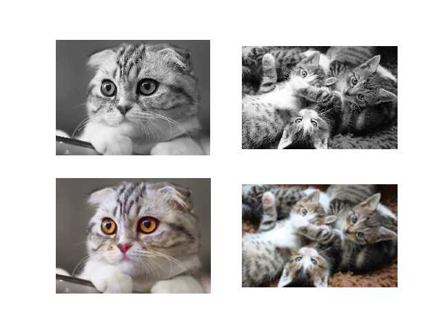
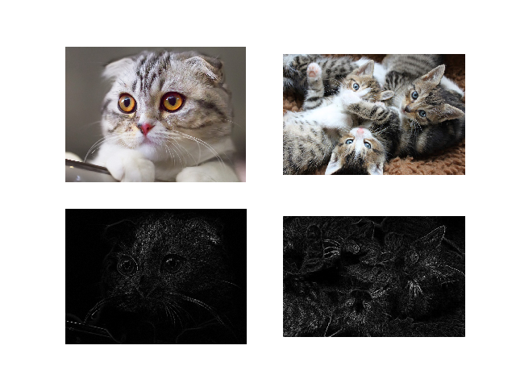
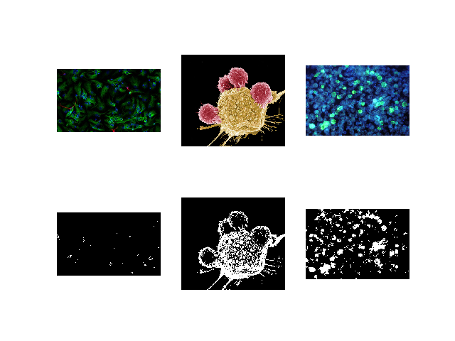
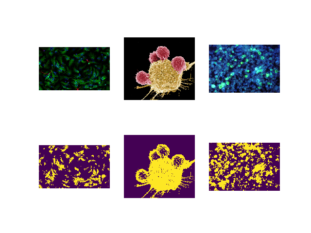

**(Semi) Automated Image Processing**

 [](https://doi.org/10.5281/zenodo.3766956)


[](https://pypi.python.org/pypi/pyautocv/)
[](https://pypi.python.org/pypi/pyautocv/)
[](https://pypi.python.org/pypi/pyautocv/)
[](https://pypi.python.org/pypi/pyautocv/)
[](https://pypi.python.org/pypi/pyautocv/)
[](https://GitHub.com/Nelson-Gon/pyautocv/graphs/commit-activity)
[](https://github.com/Nelson-Gon/pyautocv/commits/master)
[](https://www.python.org/)
[](https://GitHub.com/Nelson-Gon/pyautocv/issues/)
[](https://GitHub.com/Nelson-Gon/pyautocv/issues?q=is%3Aissue+is%3Aclosed)
[](https://github.com/Nelson-Gon/pyautocv/blob/master/LICENSE)

**Project Aims**

The goal of pyautocv is to provide a simple computer vision(cv) workflow that enables one to automate 
or at least reduce the time spent in image (pre)-processing. 

**Installing the package**

From pypi:

```

pip install pyautocv

```
From GitHub

```
pip install pip install git+https://github.com/Nelson-Gon/pyautocv.git
#or
# clone the repo
git clone https://www.github.com/Nelson-Gon/pyautocv.git
cd pyautocv
python3 setup.py install

```

**Available Class**

* Segmentation is a super class on which other classes build

* EdgeDetection is dedicated to edge detection. Currently supported kernels are stored in `.available_operators()`

* Thresholding dedicated to thresholding.


**Example Usage**

* Smoothing

To smooth a directory of images, we can use `EdgeDetection`'s `smooth` method as
follows:

```python
from pyautocv.segmentation import *
edge_detection = Segmentation("images/cats")
show_images(edge_detection.gray_images(), edge_detection.smooth())

```

This will give us:




* Edge Detection 

To detect edges in a directory of images, we can use `Segmentation`'s `detect_edges`. 

```python 

edge_detection = Segmentation("images/cats")
show_images(edge_detection.read_images(), edge_detection.detect_edges(operator="roberts", mask="gaussian", sigma=0))

```

The above will give us the following result:




To use a different filter e.g Laplace,

```

show_images(edge_detection.read_images(), edge_detection.detect_edges(operator="laplace", mask="gaussian", sigma=0))

```

This results in:


* Thresholding

To perform thresholding, we can use the method `threshold_images`.

We use flowers as an example:

```
to_threshold = Segmentation("images/biology")
show_images(to_threshold.read_images(),to_threshold.threshold_images())

```



To use a different thresholding method:

```

show_images(to_threshold.read_images(),to_threshold.threshold_images(threshold_method="otsu"))

```

The above gives us:



For cat lovers, here's thresholding with inverse binary:

```
show_images(to_threshold.read_images(),to_threshold.threshold_images(threshold_method="binary_inverse"))
```

Result:


These and more examples are available in [example2.py](./examples/example2.py). Image sources are
shown in `sources.md`. If you feel, attribution was not made, please file an issue
and cite the violating image.

> Thank you very much

> “A language that doesn't affect the way you think about programming is not worth knowing.”
― Alan J. Perlis


---

References:

* [Bebis](https://www.cse.unr.edu/~bebis/CS791E/Notes/EdgeDetection.pdf)

* [Standford, author unknown](https://ai.stanford.edu/~syyeung/cvweb/tutorial3.html)

* [Funkhouser et al.,2013](https://www.cs.princeton.edu/courses/archive/fall13/cos429/lectures/05-segmentation1)
