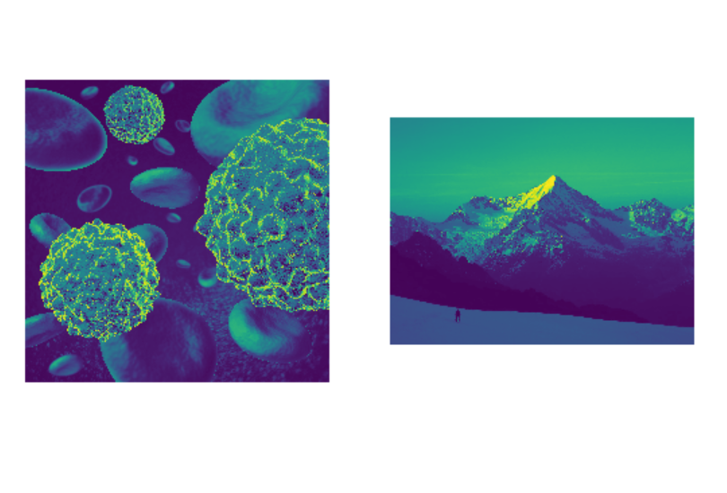

**(Semi) Automated Image Processing**

[](https://zenodo.org/badge/latestdoi/249137364)


[](https://pypi.python.org/pypi/pyautocv/)
[](https://pypi.python.org/pypi/pyautocv/)
[](https://pypi.python.org/pypi/pyautocv/)
[](https://pypi.python.org/pypi/pyautocv/)
[](https://pypi.python.org/pypi/pyautocv/)
[](https://GitHub.com/Nelson-Gon/pyautocv/graphs/commit-activity)
[](http://www.repostatus.org/#active) 
[](https://github.com/Nelson-Gon/pyautocv/commits/master)
[](https://www.python.org/)
[](https://GitHub.com/Nelson-Gon/pyautocv/issues/)
[](https://GitHub.com/Nelson-Gon/pyautocv/issues?q=is%3Aissue+is%3Aclosed)
[](https://github.com/Nelson-Gon/pyautocv/blob/master/LICENSE)

**Project Aims**

The goal of simple cv is to provide a simple computer vision(cv) workflow that enables one to automate 
or at least reduce the time spent in image (pre)-processing. 

**Installing the package**

From pypi:

```

pip install pyautocv

```
From GitHub

```
# only if you can see releases >= 1
pip install pip install git+https://github.com/Nelson-Gon/pyautocv.git
# clone the repo
git clone https://www.github.com/Nelson-Gon/pyautocv.git
cd pyautocv
python3 setup.py install

```


**Example Usage**

```
from pyautocv.segmentation import *
images_list=Segmentation("images")
images_list.show_images(thresholded=False,ncols=2)

```

The above will give us the following result:


