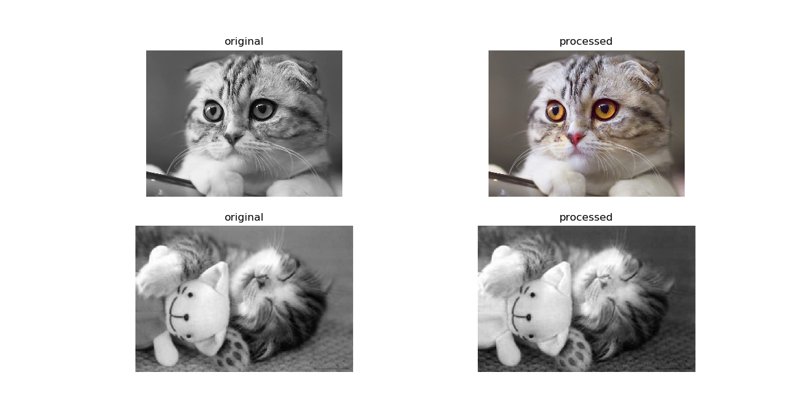
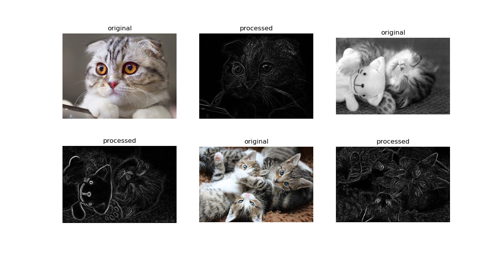
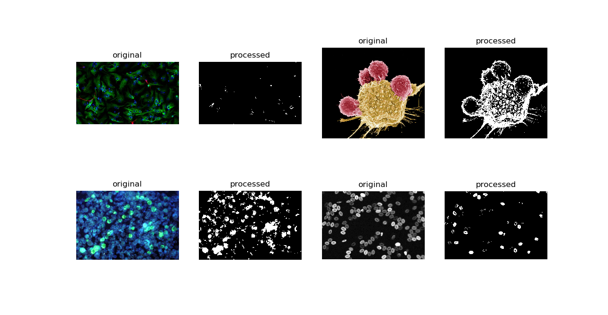
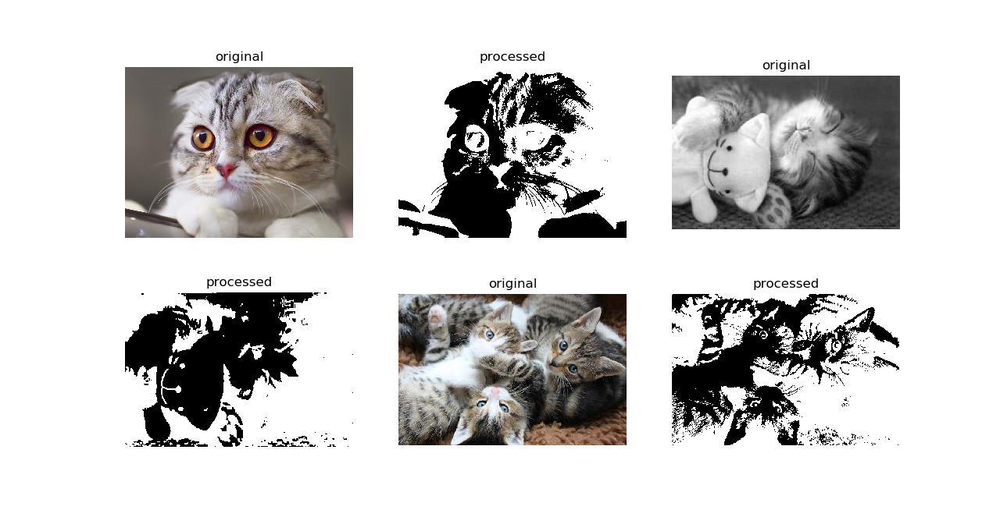
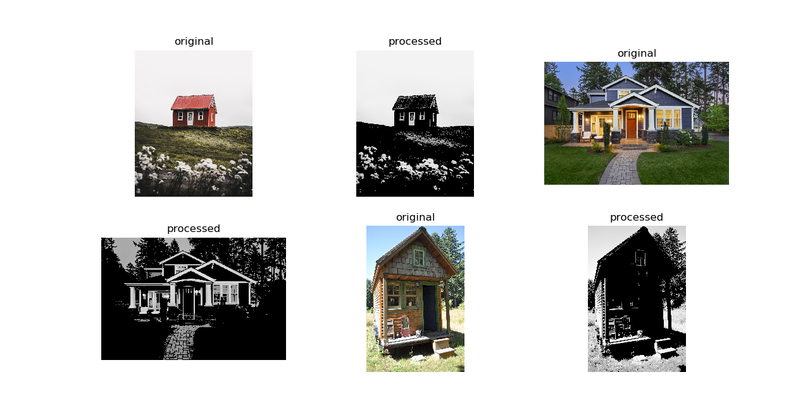

(Semi) Automated Image Processing with pyautocv
===============================================

.. image:: https://www.repostatus.org/badges/latest/wip.svg
   :target: https://www.repostatus.org/badges/latest/wip.svg
   :alt: Stage
 
.. image:: https://zenodo.org/badge/DOI/10.5281/zenodo.3766956.svg
   :target: https://doi.org/10.5281/zenodo.3766956
   :alt: DOI

.. image:: https://github.com/Nelson-Gon/pyautocv/workflows/Test-Package/badge.svg
   :target: https://github.com/Nelson-Gon/pyautocv/workflows/Test-Package/badge.svg
   :alt: Test-Package

.. image:: https://travis-ci.com/Nelson-Gon/pyautocv.svg?branch=master
   :target: https://travis-ci.com/Nelson-Gon/pyautocv.svg?branch=master
   :alt: Travis Build

.. image:: https://badge.fury.io/py/pyautocv.svg
   :target: https://pypi.python.org/pypi/pyautocv/
   :alt: PyPI version fury.io

.. image:: https://img.shields.io/pypi/l/pyautocv.svg
   :target: https://pypi.python.org/pypi/pyautocv/
   :alt: PyPI license

.. image:: https://img.shields.io/badge/Maintained%3F-yes-green.svg
   :target: https://GitHub.com/Nelson-Gon/pyautocv/graphs/commit-activity
   :alt: Maintenance

.. image:: https://img.shields.io/github/last-commit/Nelson-Gon/pyautocv.svg
   :target: https://github.com/Nelson-Gon/pyautocv/commits/master
   :alt: GitHub last commit

.. image:: https://img.shields.io/github/issues/Nelson-Gon/pyautocv.svg
   :target: https://GitHub.com/Nelson-Gon/pyautocv/issues/
   :alt: GitHub issues

.. image:: https://img.shields.io/github/issues-closed/Nelson-Gon/pyautocv.svg
   :target: https://GitHub.com/Nelson-Gon/pyautocv/issues?q=is%3Aissue+is%3Aclosed
   :alt: GitHub issues-closed

.. image:: https://img.shields.io/badge/license-MIT-blue.svg
   :target: https://github.com/Nelson-Gon/pyautocv/blob/master/LICENSE
   :alt: license

**Project Aims**

The goal of pyautocv is to provide a simple computer vision(cv) workflow that enables one to automate 
or at least reduce the time spent in image (pre)-processing. 

**Installing the package**

From pypi:

.. code-block::

   pip install pyautocv

From GitHub

.. code-block::

   pip install git+https://github.com/Nelson-Gon/pyautocv.git
   #or
   # clone the repo
   git clone https://www.github.com/Nelson-Gon/pyautocv.git
   cd pyautocv
   python3 setup.py install

**Available Class**

* 
  Segmentation is a super class on which other classes build

* 
  EdgeDetection is dedicated to edge detection. Currently supported kernels are stored in ``.available_operators()``

* 
  Thresholding dedicated to thresholding.

**Example Usage**

* Image Gra(e)ying

To grey an image directory:

.. code-block:: python

   from pyautocv.segmentation import *

   images_list=Segmentation("images/cats")
   show_images(gray_images(images_list.read_images()), images_list.read_images())

* Smoothing

To smooth a directory of images, we can use ``EdgeDetection``\ 's ``smooth`` method as
follows:

.. code-block:: python

   from pyautocv.segmentation import *

   images_list=Segmentation("images/cats")
   show_images(gray_images(images_list.read_images()), images_list.read_images())

This will give us:

.. image:: sample_results/cats_smooth.png
   :target: sample_results/cats_smooth.png
   :alt: Smooth

To use a different filter:

.. code-block:: python

   show_images(images_list.read_images(), images_list.smooth(mask="median", kernel_shape=(7, 7)))

* Edge Detection 

To detect edges in a directory of images, we can use ``Segmentation``\ 's ``detect_edges``. 

.. code-block:: python

   show_images(images_list.read_images(), images_list.detect_edges(operator="roberts", mask="gaussian", sigma=0.8))

The above will give us the following result:

To use a different filter e.g Laplace,

.. code-block::

   show_images(edge_detection.read_images(), edge_detection.detect_edges(operator="laplace", mask="gaussian", sigma=0))

This results in:

* Thresholding

To perform thresholding, we can use the method ``threshold_images``.

.. code-block::

   to_threshold = Segmentation("images/biology")
   show_images(to_threshold.read_images(),to_threshold.threshold_images())

To use a different thresholding method:

.. code-block::

   show_images(to_threshold.read_images(),to_threshold.threshold_images(threshold_method="otsu"))

The above gives us:

For cat lovers, here's thresholding with inverse binary:

.. code-block:: python

   show_images(to_threshold.read_images(),to_threshold.threshold_images(threshold_method="binary_inverse"))

Result:

Thresholding applied to houses:

.. code-block:: python

   images_list=Segmentation("images/houses")

   show_images(images_list.read_images(), images_list.threshold_images(threshold_method="thresh_to_zero"))

.. code-block:: python

   images_list=Segmentation("images/potholes")

   show_images(images_list.read_images(), images_list.threshold_images("binary"))

.. image:: ./sample_results/potholes.png
   :target: ./sample_results/potholes.png
   :alt: Potholes

These and more examples are available in `example.py <./examples/example.py>`_. Image sources are
shown in ``sources.md``. If you feel, attribution was not made, please file an issue
and cite the violating image.

..

   Thank you very much

   “A language that doesn't affect the way you think about programming is not worth knowing.”
   ― Alan J. Perlis

----

References:

* 
  `Bebis <https://www.cse.unr.edu/~bebis/CS791E/Notes/EdgeDetection.pdf>`_

* 
  `Standford, author unknown <https://ai.stanford.edu/~syyeung/cvweb/tutorial3.html>`_

* 
  `Funkhouser et al.,2013 <https://www.cs.princeton.edu/courses/archive/fall13/cos429/lectures/05-segmentation1>`_
