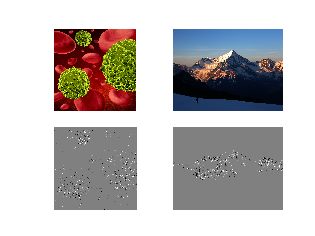
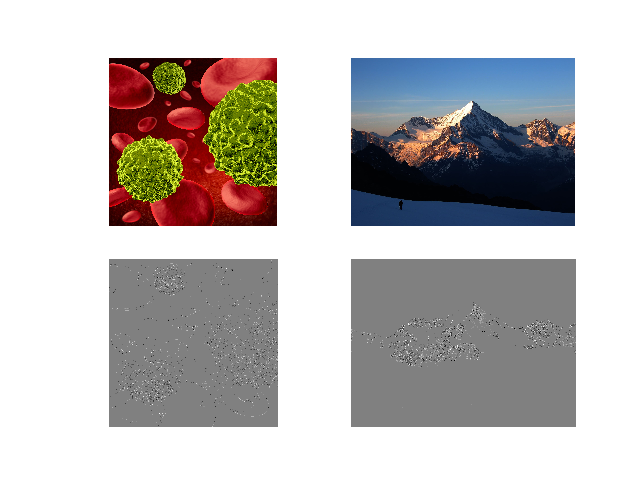
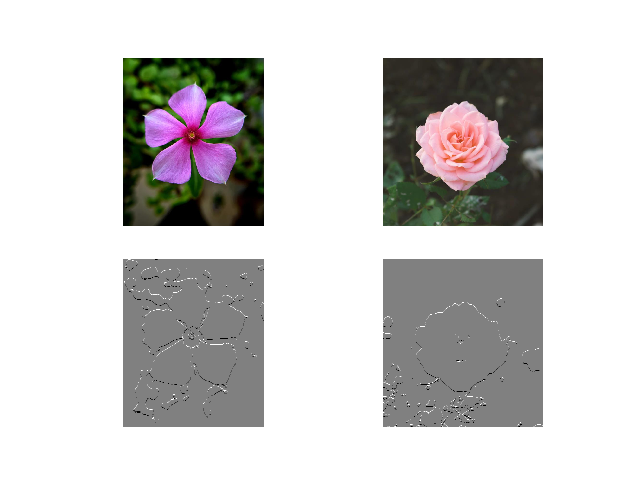

**(Semi) Automated Image Processing**

.. image:: https://zenodo.org/badge/249137364.svg
   :target: https://zenodo.org/badge/laflowersdoi/249137364
   :alt: DOI

.. image:: https://github.com/Nelson-Gon/pyautocv/workflows/Test-Package/badge.svg
   :target: https://github.com/Nelson-Gon/pyautocv/workflows/Test-Package/badge.svg
   :alt: Test-Package

.. image:: https://travis-ci.com/Nelson-Gon/pyautocv.svg?branch=master
   :target: https://travis-ci.com/Nelson-Gon/pyautocv.svg?branch=master
   :alt: Travis Build

.. image:: https://badge.fury.io/py/pyautocv.svg
   :target: https://pypi.python.org/pypi/pyautocv/
   :alt: PyPI version fury.io

.. image:: https://img.shields.io/pypi/l/pyautocv.svg
   :target: https://pypi.python.org/pypi/pyautocv/
   :alt: PyPI license

.. image:: https://img.shields.io/pypi/dm/pyautocv.svg
   :target: https://pypi.python.org/pypi/pyautocv/
   :alt: PyPI download Month

.. image:: https://img.shields.io/pypi/dw/pyautocv.svg
   :target: https://pypi.python.org/pypi/pyautocv/
   :alt: PyPI download week

.. image:: https://img.shields.io/pypi/dd/pyautocv.svg
   :target: https://pypi.python.org/pypi/pyautocv/
   :alt: PyPI download day

.. image:: https://img.shields.io/badge/Maintained%3F-yes-green.svg
   :target: https://GitHub.com/Nelson-Gon/pyautocv/graphs/commit-activity
   :alt: Maintenance

.. image:: http://www.repostatus.org/badges/laflowers/active.svg
   :target: http://www.repostatus.org/#active
   :alt: Project Status
 

.. image:: https://img.shields.io/github/last-commit/Nelson-Gon/pyautocv.svg
   :target: https://github.com/Nelson-Gon/pyautocv/commits/master
   :alt: GitHub last commit

.. image:: https://img.shields.io/badge/Made%20with-Python-1f425f.svg
   :target: https://www.python.org/
   :alt: made-with-python

.. image:: https://img.shields.io/github/issues/Nelson-Gon/pyautocv.svg
   :target: https://GitHub.com/Nelson-Gon/pyautocv/issues/
   :alt: GitHub issues

.. image:: https://img.shields.io/github/issues-closed/Nelson-Gon/pyautocv.svg
   :target: https://GitHub.com/Nelson-Gon/pyautocv/issues?q=is%3Aissue+is%3Aclosed
   :alt: GitHub issues-closed

.. image:: https://img.shields.io/badge/license-MIT-blue.svg
   :target: https://github.com/Nelson-Gon/pyautocv/blob/master/LICENSE
   :alt: license

**Project Aims**

The goal of simple cv is to provide a simple computer vision(cv) workflow that enables one to automate 
or at least reduce the time spent in image (pre)-processing. 

**Installing the package**

From pypi:

.. code-block::

   pip install pyautocv

From GitHub

.. code-block::

   # only if you can see releases >= 1
   pip install pip install git+https://github.com/Nelson-Gon/pyautocv.git
   # clone the repo
   git clone https://www.github.com/Nelson-Gon/pyautocv.git
   cd pyautocv
   python3 setup.py install

**Example Usage**

.. code-block::

   from pyautocv.segmentation import *
   images_list=Segmentation("images")
   images_list.show_images()

The above will give us the following result:

To use a different filter e.g Laplace,

.. code-block::

   images_list.show_images(operator="laplace")

This results in:

Flowers

.. code-block::

   images_list=Segmentation("images/flowers")
   images_list.show_images(operator="prewitt_vertical")

Using Prewitt, let's try to see if we can identify potholes in an image:

.. code-block::

   images_list=Segmentation("images/potholes")
   images_list.show_images(operator="prewitt_vertical")

.. image:: sample_results/potholes.png
   :target: sample_results/potholes.png
   :alt: Prewitt Vertical

Currently available filters:

* 
  Standard Sobel

* 
  Standard Prewitt

* 
  Laplacian

* 
  Roberts

These and more examples are available in `example.py <./examples/example.py>`_

----

References:

* `Bebis <https://www.cse.unr.edu/~bebis/CS791E/Notes/EdgeDetection.pdf>`_
